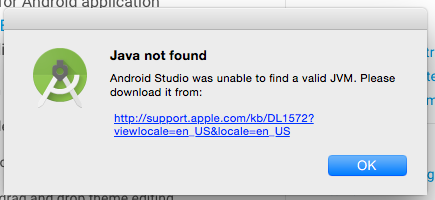
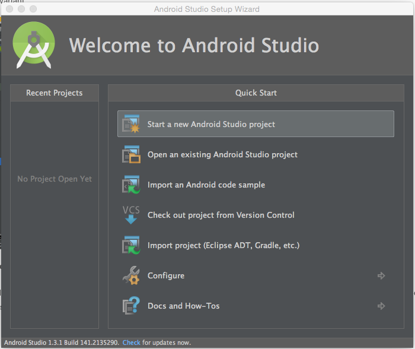
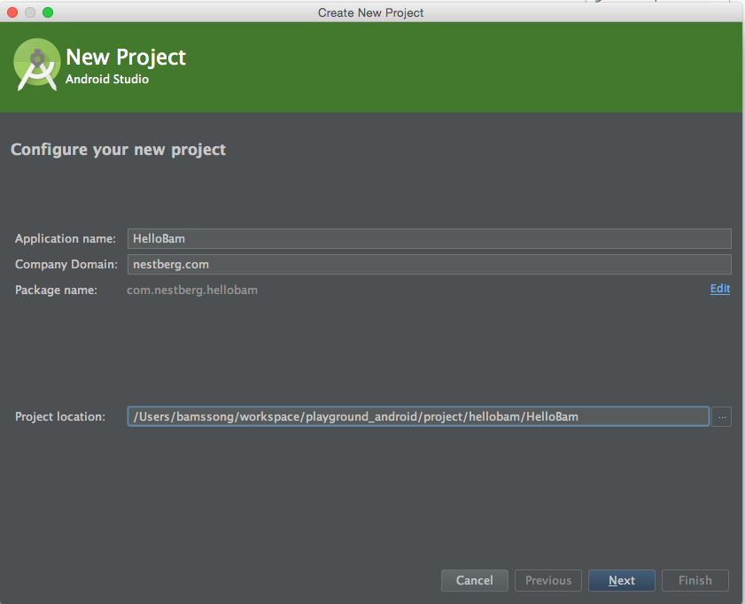
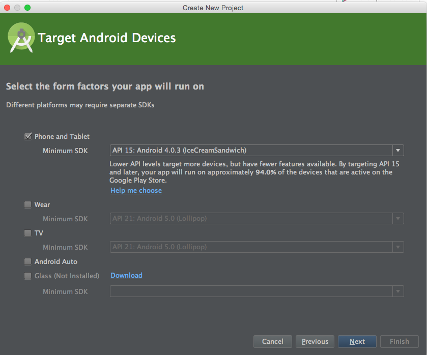
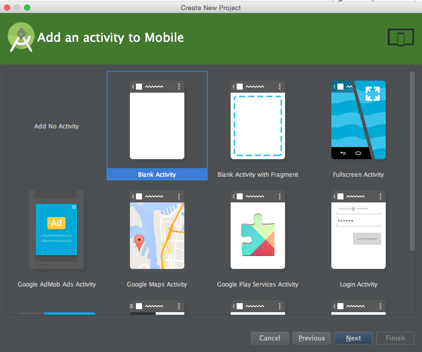
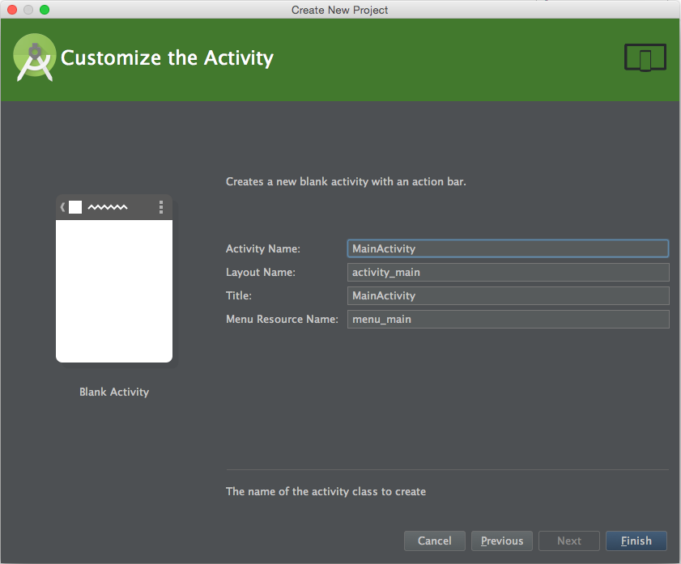
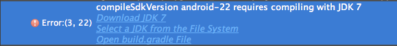
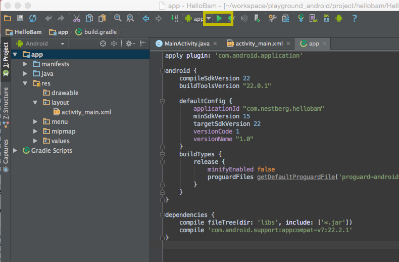
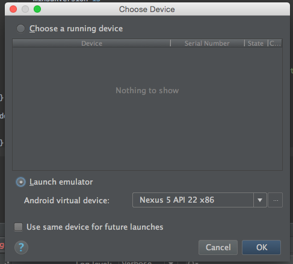

# Helow Android (Mac 환경 )

### [dev.android.com](http://developer.android.com/index.html)
### [윈도우에서 설치 보러가기](http://prolite.tistory.com/456)
### [Android Studio NDK](http://tools.android.com/tech-docs/new-build-system/gradle-experimental)

> 단! Mac 10.10 Yosemite 사용자라면, 해당 이슈를 참고해서 설치.
>  [http://tools.android.com/tech-docs/configuration/osx-jdk](http://tools.android.com/tech-docs/configuration/osx-jdk)
>   [jdk8](http://www.oracle.com/technetwork/java/javase/downloads/jdk8-downloads-2133151.html)을 먼저 설치 후 [jdk 6](https://support.apple.com/kb/DL1572?locale=ko_KR)을 설치한다.

## 작업 환경 만들기
1. Android Studio [다운로드](http://developer.android.com/sdk/index.html)

2. Android Studio 실행

	

3. jdk 설치  후 Android Studio 재실행

4. Android Studio 설정 (next ~ next 한다)

5. SDK 다운로드 요청하기

	

## 프로젝트 만들기

## JDK 7 이상 버전 추가 설치
> compile sdk version 22 이상 사용할 경우 jdk7 이상 버전이 필요하다.
 

## 실행하기

실행 버튼 선택 
 

'Ok' 버튼 선택 
 

