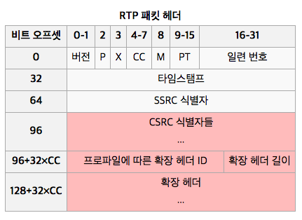
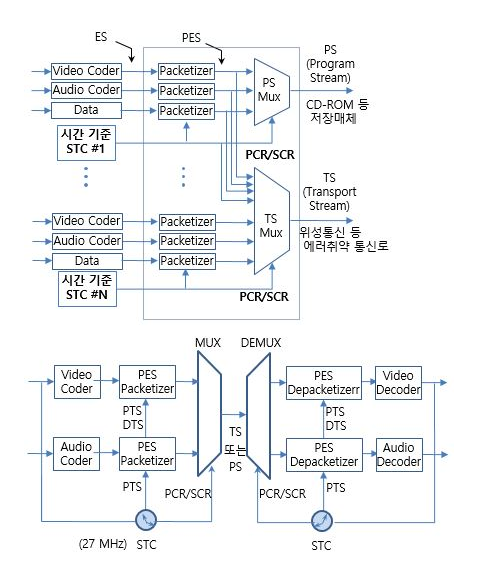

# 스트리밍 서비스 

## 스트리밍 프로토콜 이해

RTSP : Real Time Streaming Protocol
RTP : Real-time Transport Protocol

### RTSP : Real Time Streaming Protocol
> 실시간 스트리밍 프로토콜

RTSP 규약은 HTTP 규약하고 비교해 볼 때, 문법이나 동작이 비슷하다. 하지만, HTTP 가 무상태형(stateless)인 반면에 RTSP는 상태형(stateful) 규약이다. 임의의 세션 ID는 세션 추적할 때마다 사용되는데, 이 방법은 영구 TCP 연결을 필요로 한다. RTSP 메시지는 클라이언트에서 서버로 간다. 만약, 서버에서 오류가 발생한다면 서버는 오류에 대한 응답 코드를 클라이언트로 보내준다. 기본적인 RTSP 요청 메시지는 아래와 같고, 기본 포트는 554번이다.

#### DESCRIBE
DESCRIBE 요청에는 URL (rtsp://...)이 포함된다. 기본 포트 554번은 UDP, TCP 둘 다에 사용된다. DESCRIBE에 대한 응답 메시지에는 요청한 것에 대한 설명도 포함되는데, 대개 SDP 형태를 갖추고 있다.

#### SETUP
SETUP 요청은 단일 미디어 스트림이 전송되어야 하는지 규정한다. 이 요청은 PLAY 요청 하기 전에 마쳐야한다. 그리고 요청할 때 미디어 스트림 URL과 전송점을 포함해야 한다. 전송점에는 RTP 데이터(오디오/비디오), RTCP 데이터(메타 정보)를 전송받기 위한 포트 번호도 포함된다.

#### PLAY
PLAY 요청은 하나 또는 모든 미디어 스트림을 재생시킨다. PLAY 명령은 다중 요청이 가능하다. 모든 미디어 스트림 재생을 위해서는 URL 집합체가 요청에 포함되어야 한다. 재생 범위를 구체적으로 지정할 수도 있다. 만약에 재생 범위를 지정하지 않으면, 미디어 처음부터 끝까지 재생한다. 또, 일시 정지 상태라면 일시 정지된 위치부터 재생 된다.

#### PAUSE
PAUSE 요청은 하나 또는 모든 미디어 스트림에 대해서 일시 중지를 명령한다. PLAY 요청으로 다시 재시작 할 수 있다. 이 요청 메시지에는 미디어 스트림 URL이 포함되어야 한다. 일시 정지를 할 때 범위를 구체적으로 지정할 수도 있다.

#### RECORD
RECORD 요청은 녹화를 위한 명령어이다.

#### TEARDOWN
TEARDOWN 요청은 세션을 종료하기 위한 명령어이고, 모든 미디어 스트림의 재생을 중단하고 서버에 있는 관련 데이터에 걸린 모든 세션도 해제한다.

### RTP : Real-time Transport Protocol
> 실시간 전송 프로토콜

### RTCP : Real-time Transport Control Protocol

## MPEG 트랜스포트 스트림
MPEG 트랜스포트 스트림(MPEG transport stream, 곧 TS, TP, MPEG-TS로 줄임)

비디오, 데이터 전송을 위한 통신 프로토콜이다. PES(packetized elementary streams) 와 기타 데이터를 포함하는 디지털 컨테이너 포맷의 일종이다. TS는 MPEG-2 파트 1, 시스템(ISO/IEC 표준 13818-1)에 규정되어 있다.[2] ITU-T Rec. H.222.0으로도 알려져 있다. 디지털 영상과 소리를 다중화하고 출력을 동기화하는 것이 이 시스템의 목표이다. 트랜스포트 스트림은 신뢰할 수 없는 매체의 오류 정정 기능을 제공하고 DVB와 ATSC와 같은 영상 응용에도 쓰인다. DVD와 같은 신뢰할 수 있는(데이터 손실 우려가 없는) 매체용으로 개발된 MPEG 프로그램 스트림과는 대조된다.

